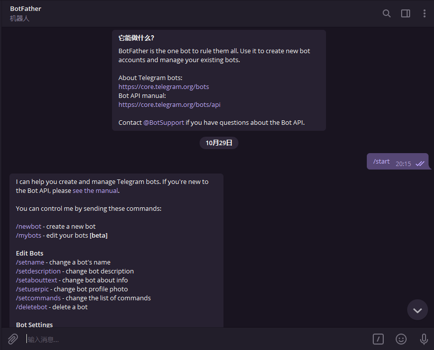
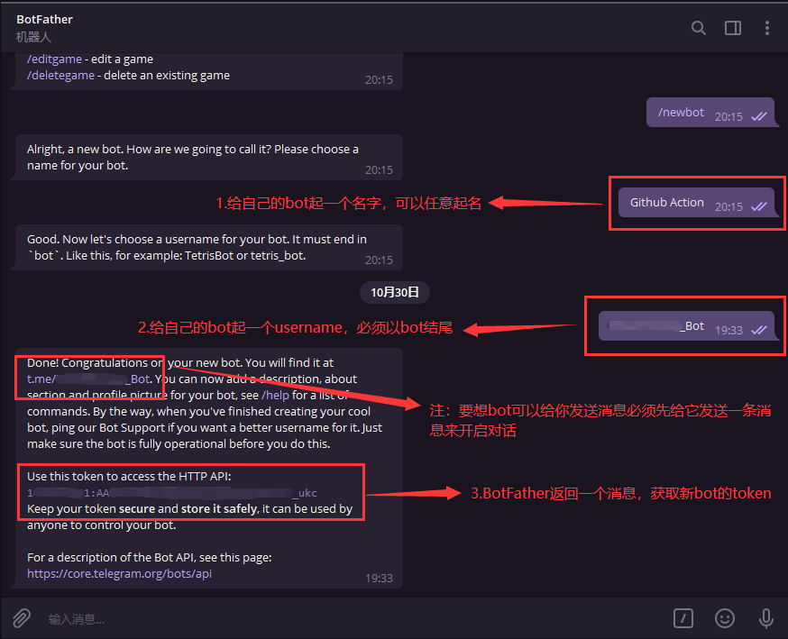
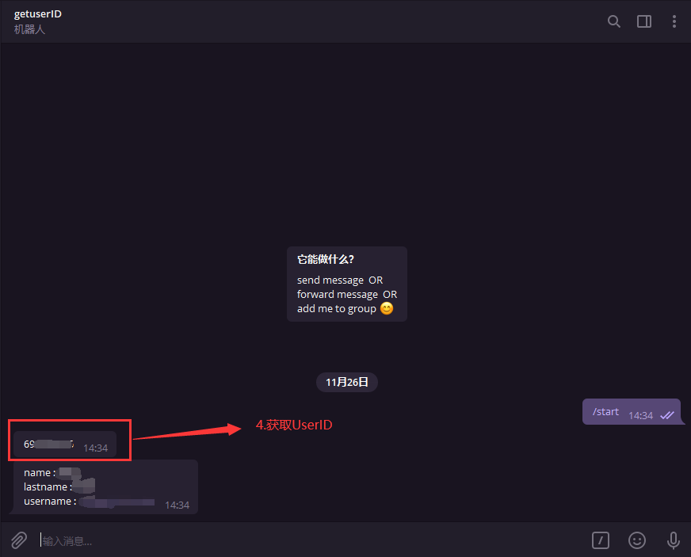

**TG_PUSH教程**

利用Telegram机器人推送通知，需要在环境变量填入正确的```TG_BOT_TOKEN```以及```TG_USER_ID```，以下教程简明阐述如何获取token以及UserID

Ⅰ.首先在Telegram上搜索[BotFather](https://t.me/BotFather)机器人<br>



Ⅱ.利用[BotFather](https://t.me/BotFather)创建一个属于自己的通知机器人，按照下图中的1、2、3步骤拿到token，格式形如```10xxx4:AAFcqxxxxgER5uw```。填入```TG_BOT_TOKEN```<br>

<br>

**新创建的机器人需要跟它发一条消息来开启对话，否则可能会遇到secret填对了但是收不到消息的情况**<br>

Ⅲ.再次在Telegram上搜索[getuserIDbot](https://t.me/getuserIDbot)机器人，获取UserID。填入```TG_USER_ID```<br>



至此，获取**TG_BOT_TOKEN**以及**TG_USER_ID**的教程结束
