## 保持自己github的forks自动和上游仓库同步的教程
 - 信息来源于 [https://github.com/wei/pull](https://github.com/wei/pull)
 - 以下教程仅是出于个人爱好，不保证本教程的完全正确性，最终请以作者 [https://github.com/wei/pull](https://github.com/wei/pull) 的描述为准。
 - 注：此教程由telegram用户@wukongdada提供
### 1、只同步默认分支的教程	

> 当上游的仓库仅有一个默认分支。或者上游仓库有两个分支，我们仅需要同步他的默认分支，其他分支对内容对我们来说无关紧要。

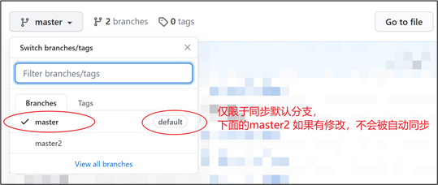
      
      	

a)  登录自己的github账号，另开网页打开 [https://github.com/wei/pull](https://github.com/wei/pull)	

b)  点击Pull app进行安装。	

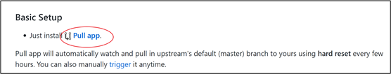	

c)  安装过程中会让你选择要选择那一种方式，All repositories(就是同步已经frok的仓库以及未来fork的仓库)，Only select repositories(仅选择要自己需要同步的仓库，其他fork的仓库不会被同步)，根据自己需求选择，实在不知道怎么选择，就选All repositories；点击install，完成安装。	

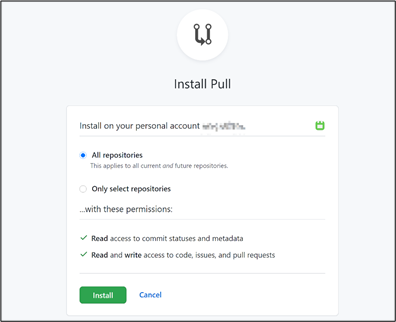	

d)  后续，如果要调整1.c中的选项，打开 [https://github.com/apps/pull](https://github.com/apps/pull) ，点击Configure，输入github密码进入pull的相关设置。	

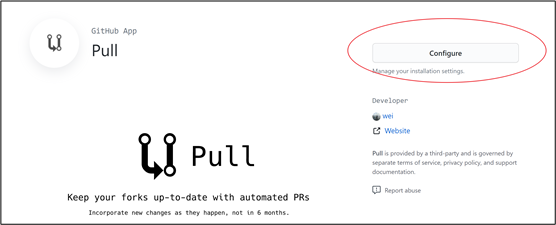	

e)  进入后，找到Repository access，根据自己的需求，重新选择：All repositories(就是同步已经frok的仓库以及未来fork的仓库)，Only select repositories(仅选择要自己需要同步的仓库，其他fork的仓库不会被同步)，Save后保存生效。	

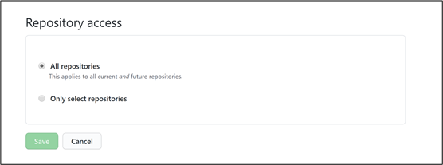	

f)  Pull app作者虽然在项目中写道keeps your forks up-to-date with upstream via automated pull requests，但当上游仓库有更改时，自己的仓库会在3个小时内完成与上游的同步，3个小时是Pull app作者说的最长时间。当然也可以通过手动触发同步上游仓库，手动触发方式：`https://pull.git.ci/process/你的GitHub名字/你的仓库名字` （例如：`https://pull.git.ci/process/xxxxx/test` ），手动触发可能会进行人机验证，验证通过后会显示Success。

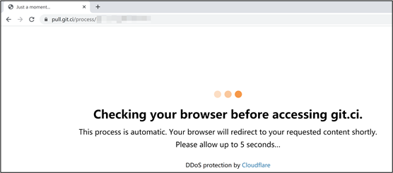                                                                      

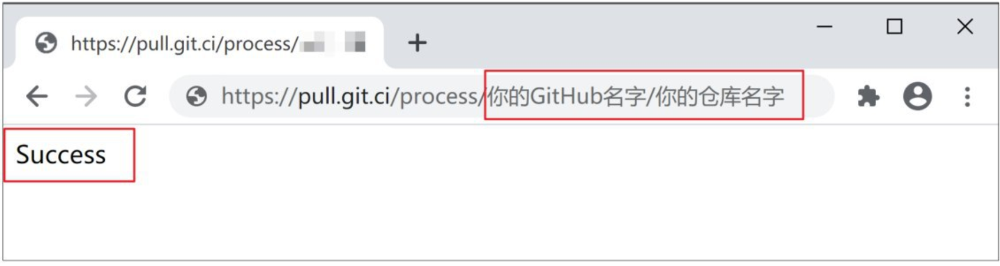	

### 2、同步其他分支的教程	

 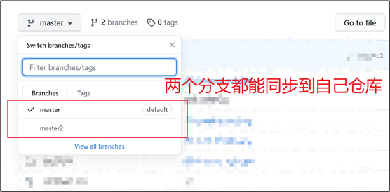	

a)  假设你fork了上游仓库后，你fork后的地址为 `https://github.com/你的仓库名字/test` ，首先设置完成第1部分内容，注意在1.c步骤没有设置全部同步的，要回到1.e步，确认是否设置同步了 `你的仓库名字/test`，如果没有,请添加上。	

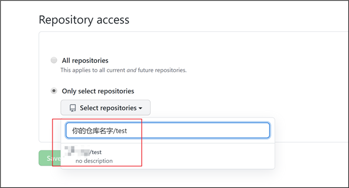	

b)  在默认分支下添加一个文件。	

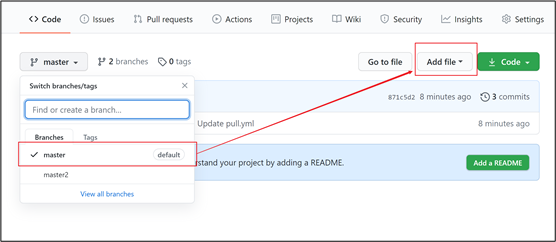	

c)  复制 ``.github/pull.yml`` 粘贴后看到以下页面，注意github前面的那个.别漏掉了。	

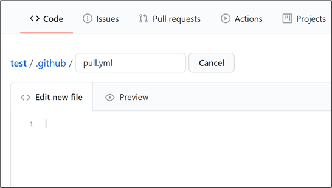	

d)  请在https://github.com/wei/pull\#advanced-setup-with-config 页复制代码，	

注意：upstream处要修改为上游仓库作者名字。	

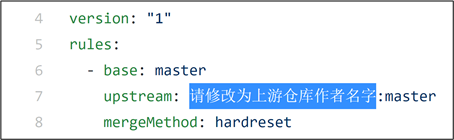                                                                      

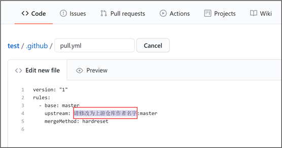	

e)  最终的示例如下，假设上游作者是zhangsan，所有的注意点都用红线圈出来了，保存后生效。	

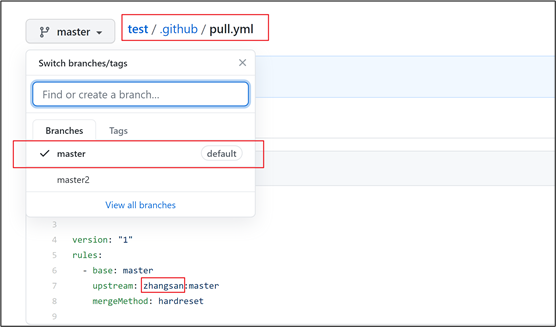	

f)  Pull app作者虽然在项目中写道keeps your forks up-to-date with upstream via automated pull requests，但当上游仓库有更改时，自己的仓库会在3个小时内完成与上游的同步，3个小时是Pull app作者说的最长时间。当然也可以通过手动触发同步上游仓库，手动触发方式：`https://pull.git.ci/process/你的GitHub名字/你的仓库名字` （例如：`https://pull.git.ci/process/xxxxx/test`），手动触发可能会进行人机验证，验证通过后会显示Success。具体见1.f提供的图片。	

g)  本人仅测试过forks一个仓库只有2个分支的项目，如果有多个分支，不能保证是否可行，请自行测试，或者是使用本教程第3部分高级玩法。	

### 高级玩法	

>当然，作者还有其他更好的项目用于同步所有分支，例如使用 GitHub actions 进行同步。请参考原作者的项目 

- [https://github.com/wei/git-sync](https://github.com/wei/git-sync)
- [https://github.com/repo-sync/github-sync](https://github.com/repo-sync/github-sync)
