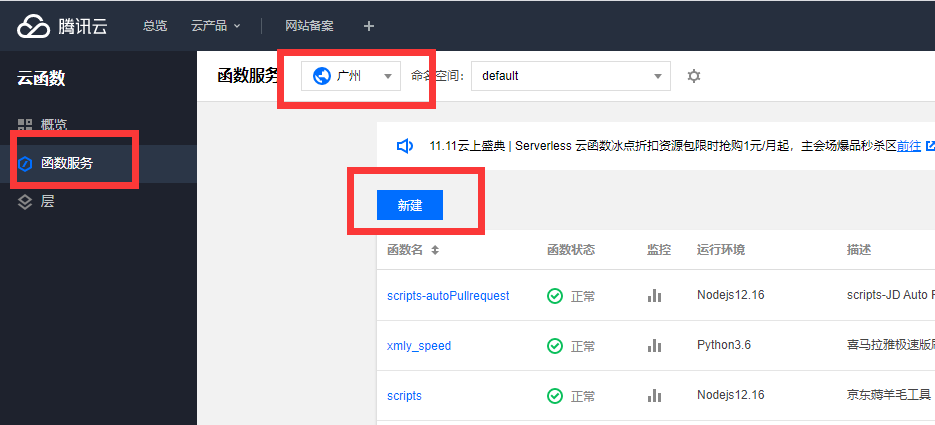
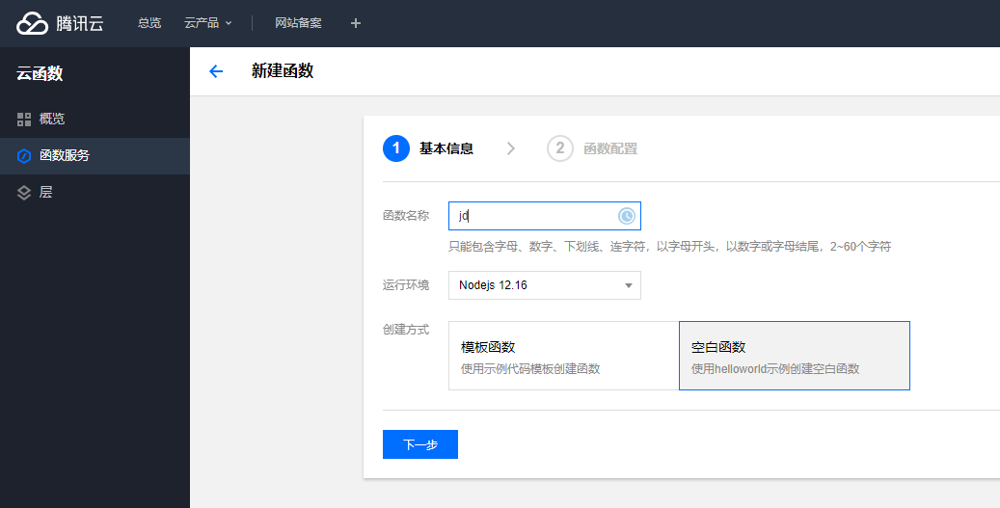
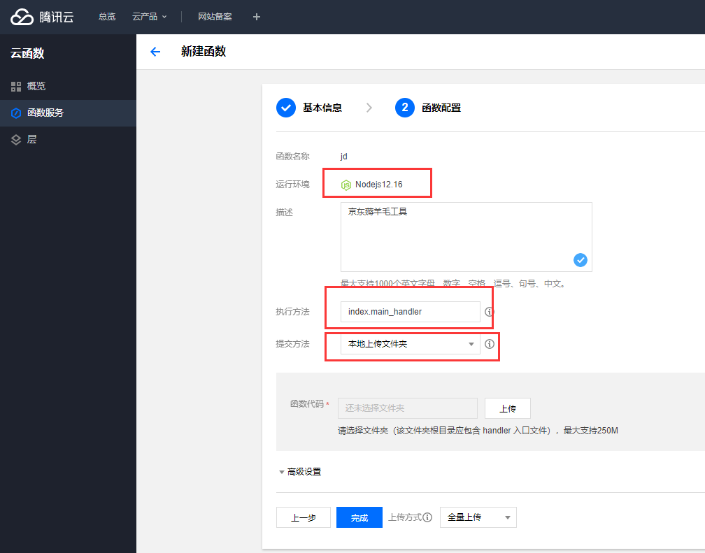
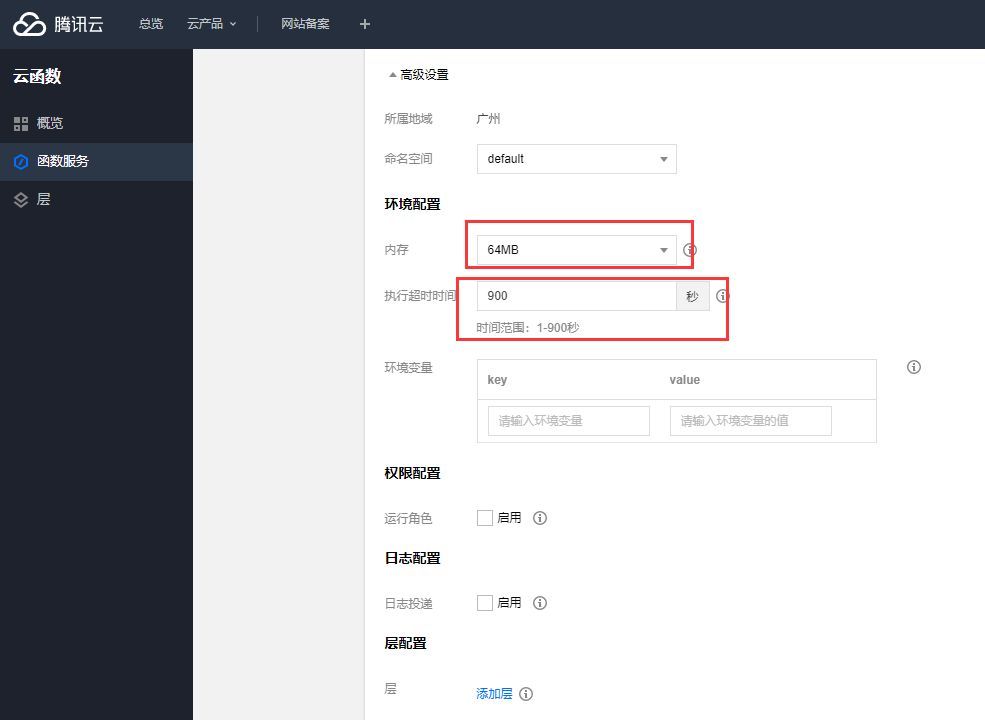
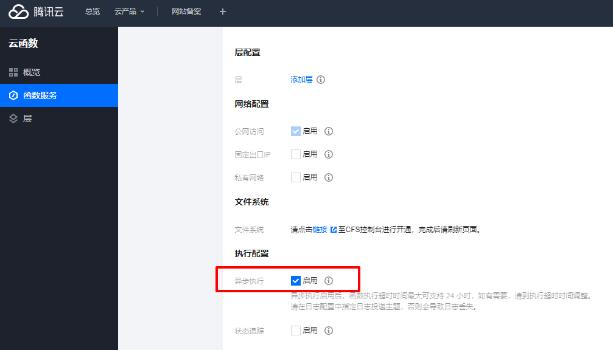
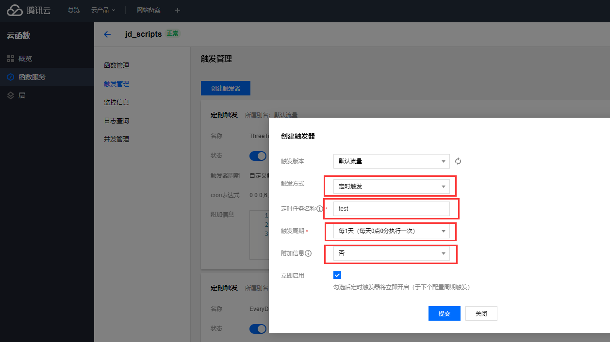

## 1.安装 Node.js 环境

[下载地址](https://nodejs.org/zh-tw/download/ )

根据自己的操作系统下载

傻瓜式安装，一直下一步即可。


## 2.下载源码


点击红框处下载压缩包

## 3.安装依赖、增加入口文件、增加cookie

压缩包解压后进入项目文件夹

- Windows 用户按住  **shift** 点击右键，点击 **在此处打开命令窗口**
- Mac 用户通过终端，自行进入该文件夹

在命令行内输入 `npm i `，等待运行完成。

此时，项目文件夹内会多出一个 `node_modules`文件夹

 **增加入口文件**

方案一：同一个仓库下同一个时间，执行多个脚本

在项目文件夹内新建 `index.js`

编辑文件

```javascript
'use strict';
exports.main_handler = async (event, context, callback) => {
  //解决云函数热启动问题
  delete require.cache[require.resolve('./jd_xtg1.js')];
  require('./jd_xtg1.js') //这里写你想要的脚本
  require('./jd_xtg2.js') //这里写你想要的脚本
  require('./jd_xtg3.js') //这里写你想要的脚本
}

```
此时，同一时间点下，会同时执行多个脚本，触发器触发后，index.js文件中require()下的所有脚本都会被执行

**优点**：同一时间下可以同时执行多个脚本，适合脚本种类少的repository，对脚本数量少的repository推荐使用此方案<br>**缺点**：多个脚本不同时间点运行无法满足

方案二：同一个仓库下不同的时间点，分别执行不同的脚本（类似GitHub Action执行机制）

在项目文件夹内新建 `index.js`

编辑文件

```javascript
'use strict';
exports.main_handler = async (event, context, callback) => {
    for (const v of event["Message"].split("\r\n")) {
        //解决云函数热启动问题
        delete require.cache[require.resolve(`./${v}.js`)];
        console.log(v);
        require(`./${v}.js`)
    }
}

```

此时触发管理按照下图中进行设置，附加信息选择“是”，内容填写需要传递执行的具体脚本文件名，以回车键换行。触发器触发后，附加信息栏内的脚本会被执行，设置多个不同时间点的触发器达到类似GitHub Action的效果

**优点**：可以满足个性化需求，同一个repository下只需要设置不同的触发器，可以实现不同时间点分别执行不同的脚本<br>**缺点**：repository下脚本过多，如果需要设置多个触发器，实现个性化运行效果，由于云函数的限制，最多只能设置10个

[](https://imgchr.com/i/B20KxI)
[](https://imgchr.com/i/BRCG0H)

**注意：**<br>
Ⅰ方案一与方案二不能混合到同一个index.js文件中使用，同一个仓库下，二者只能选择其一。<br>
Ⅱ感谢[issues#115](https://github.com/LXK9301/jd_scripts/issues/115)中的解决方案，目前云函数连续测试已经可以规避热启动问题了。<br>
Ⅲ在确保完全按照本教程设置的情况下测试云函数运行情况，对于部分人运行日志中出现某些脚本运行失败其他正常，并且错误提示带有strict字样的，请自行删除index.js中的```'use strict';```，再做测试<br>

 **增加cookie**

打开项目文件内的 `jdCookie.js`

在最上面的 `CookieJDs`里写入 cookie ，多个账号以逗号分隔

例如

```javascript
let CookieJDs = [
  'pt_key=xxx;pt_pin=xxx;', 
  'pt_key=zzz;pt_pin=zzz;',
  'pt_key=aaa;pt_pin=xxxaaa'
]
```


## 4.上传至腾讯云

[腾讯云函数地址]( https://console.cloud.tencent.com/scf/index )

编写函数

登录后，点击管理控制台

单击左侧导航栏**函数服务**，进入“函数服务”页面。
在页面上方选择一个地域，最好选择离你常用地区近点的，不至于导致账号异常。单击**新建**。如下图所示：



在“新建函数”页面填写函数基础信息，单击**下一步**。如下图所示：



**函数名称**：可以自定义，比如为jd。<br>**运行环境**：选择 “Nodejs 12.16”。<br>**创建方式**：选择 “空白函数”。

确保环境为Nodejs 12.16，执行方法改为：index.main_handler，提交方式建议选本地文件夹，然后从GitHub项目克隆Zip压缩包，解压成文件夹，然后点击这个上传把文件夹上传进来（记得node_modules文件夹一并上传或者将node_modules文件夹上传到“层”，之后选择“函数管理”-“层管理”绑定上传好的层），完了后点击下面的高级设置。



内存用不了太大，64MB就够了（64M内存，免费时长6,400,000秒，内存与免费时长大致关系可以参看云函数官方说明），超时时间改为最大的900秒，然后点击最下面的完成。



默认设置下，云函数运行时长最长900s，可以通过设置突破900s限制，**此方法仅适用于新建函数名时设置，已建的无法更改，需要删除后重建**。<br>

新建函数，选择**高级配置**，**执行配置**，启用**异步执行**，之后在**环境配置**下**执行超时时间**，最大可以选择**86400秒**的执行时间。<br>




## 5.设置触发器

点击刚创建的函数


点击如图所示


创建触发器



触发方式默认“**定时触发**”，定时任务名称随便起个名字，触发周期根据自己需要自行设置。

想进阶使用触发器的自行查看本文中方案一和方案二中的说明

关于触发周期中的自定义触发周期，使用的是 Cron表达式，这个自行学习下吧


[Corn文档](https://cloud.tencent.com/document/product/583/9708#cron-.E8.A1.A8.E8.BE.BE.E5.BC.8F)

目前repo中按照每个脚本一个定时器的方式设置到云函数中，大约需要触发器10多个，由于云函数触发器限制最多10个，需要对触发器进行整合，整合后触发器保持在10个以内，以下设置仅供参考<br>

|      JavaScript      |         脚本名称          | 活动时间 |  serverless.yml   |
| :------------------: | :-----------------------: | :------: | :---------------: |
|    `getJDCookie`     |    扫码获取京东Cookie     |   长期   |         /         |
|   `jd_bean_change`   |       京豆变动通知        |   长期   |    30 7 * * *     |
|    `jd_bean_home`    |      领京豆额外奖励       |   长期   |    30 7 * * *     |
|    `jd_bean_sign`    |         京豆签到          |   长期   |     0 0 * * *     |
|     `jd_beauty`      |        美丽研究院         |   长期   | 0 0-16/8,20 * * * |
|    `jd_blueCoin`     |      京小超兑换奖品       |   长期   |     0 0 * * *     |
|    `jd_bookshop`     |         口袋书店          |   长期   | 5 6-18/6,8 * * *  |
|       `jd_car`       |         京东汽车          |   长期   |    10 0 * * *     |
|  `jd_car_exchange`   |       京东汽车兑换        |   长期   |     0 0 * * *     |
|      `jd_cash`       |        签到领现金         |   长期   | 0 0-16/8,20 * * * |
|       `jd_cfd`       |        京喜财富岛         |   长期   | 0 0-16/8,20 * * * |
|  `jd_club_lottery`   |          摇京豆           |   长期   |     0 0 * * *     |
|    `jd_crazy_joy`    |         疯狂的joy         |   长期   |    30 7 * * *     |
| `jd_crazy_joy_bonus` |     监控crazyJoy分红      |   长期   |    30 7 * * *     |
| `jd_crazy_joy_coin`  |       疯狂的joy挂机       |   长期   |         /         |
|    `jd_daily_egg`    |     京东金融-天天提额     |   长期   |    8 */3 * * *    |
|    `jd_delCoupon`    |        删除优惠券         |   长期   |         /         |
|  `jd_dreamFactory`   |         京喜工厂          |   长期   |    3 */1 * * *    |
|     `jd_family`      |        京东家庭号         |   长期   | 5 6-18/6,8 * * *  |
|      `jd_fruit`      |         东东农场          |   长期   | 5 6-18/6,8 * * *  |
| `jd_get_share_code`  |        获取互助码         |   长期   |         /         |
|    `jd_jdfactory`    |         东东工厂          |   长期   |    3 */1 * * *    |
|      `jd_jdzz`       |         京东赚赚          |   长期   |     3 1 * * *     |
|       `jd_joy`       |          宠汪汪           |   长期   |    3 */1 * * *    |
|  `jd_joy_feedPets`   |      宠汪汪单独喂食       |   长期   |    3 */1 * * *    |
|    `jd_joy_help`     |   宠汪汪强制为别人助力    |   长期   |         /         |
|   `jd_joy_reward`    |      宠汪汪兑换奖品       |   长期   | 0 0-16/8,20 * * * |
|     `jd_joy_run`     | 宠汪汪邀请助力与赛跑助力  |   长期   |         /         |
|       `jd_jxd`       |          京小兑           |   长期   |    30 7 * * *     |
|      `jd_jxnc`       |         京喜农场          |   长期   | 5 6-18/6,8 * * *  |
|       `jd_kd`        |         京东快递          |   长期   |     3 1 * * *     |
|      `jd_live`       |       京东直播18豆        |   长期   | 0 0-16/8,20 * * * |
|  `jd_live_redrain`   |     超级直播间红包雨      |   长期   |         /         |
| `jd_lotteryMachine`  |        京东抽奖机         |   长期   |    10 0 * * *     |
|    `jd_moneyTree`    |          摇钱树           |   长期   |    3 */1 * * *    |
|       `jd_ms`        |        京东秒秒币         |   长期   |    10 0 * * *     |
|    `jd_necklace`     |          点点券           |   长期   | 0 0-16/8,20 * * * |
|       `jd_pet`       |         东东萌宠          |   长期   | 5 6-18/6,8 * * *  |
|     `jd_pigPet`      |      京东金融-养猪猪      |   长期   |     3 1 * * *     |
|    `jd_plantBean`    |         种豆得豆          |   长期   |    3 */1 * * *    |
|      `jd_price`      |         京东保价          |   长期   |    30 7 * * *     |
|   `jd_rankingList`   |        京东排行榜         |   长期   |    30 7 * * *     |
|    `jd_redPacket`    |        全民开红包         |   长期   |    10 0 * * *     |
|      `jd_sgmh`       |         闪购盲盒          |   长期   |    30 7 * * *     |
|      `jd_shop`       |         进店领豆          |   长期   |    10 0 * * *     |
|   `jd_small_home`    |         东东小窝          |   长期   | 0 0-16/8,20 * * * |
|      `jd_speed`      |         天天加速          |   长期   |    8 */3 * * *    |
|   `jd_speed_sign`    | 京东极速版签到+赚现金任务 |   长期   | 5 6-18/6,8 * * *  |
|   `jd_superMarket`   |         东东超市          |   长期   |   15 */6 * * *    |
|       `jd_syj`       |          十元街           |   长期   |     3 1 * * *     |
|   `jd_unsubscribe`   |    取关京东店铺和商品     |   长期   |    10 0 * * *     |
|      `jx_sign`       |         京喜签到          |   长期   |     3 1 * * *     |

点击提交，所有流程就结束了。
